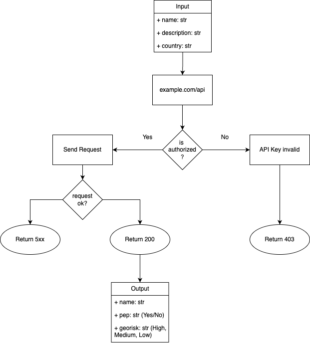
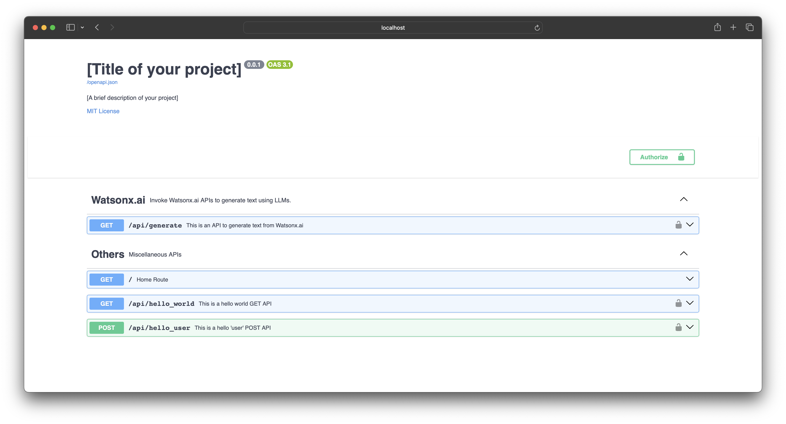
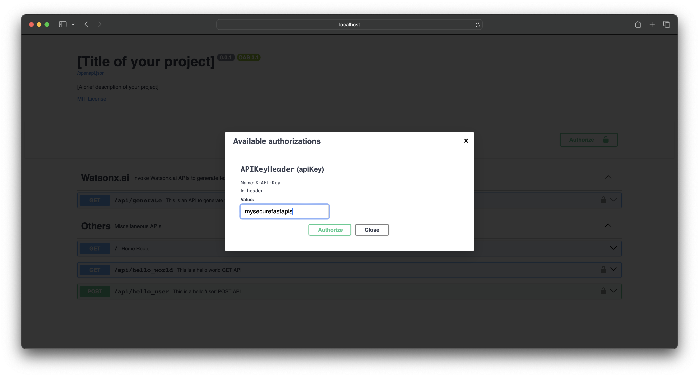

# Pkyc-evaluation

APIs to evaluate Politically exposed person (PEP) and Geo-Risk.



## Table of content

1. [Run the FastAPIs locally](#1-run-the-fastapis-locally)
1. [Project Structure](#2-project-structure)
1. [Deploy the FastAPIs on Code Engine](#4-deploy-the-fastapis-on-code-engine)

## 1. Run the FastAPIs locally

1. Clone the repo. In terminal run,

    ```bash
    git clone https://github.ibm.com/ecosystem-engineering-si-lab/pkyc-evaluation.git
    ```

2. Goto the root of the cloned repo and install the python dependencies.
    - Navigate to the root of the cloned repo,

        ```bash
        cd pkyc-evaluation/
        ```

    - Create a python virtual environment,

        ```bash
        virtualenv venv
        source venv/bin/activate
        ```

    - Install the python dependencies,

        ```bash
        pip install -r requirements.txt
        ```

3. Export environment varibles and run the application.
    - Export the environment variables,

        ```bash
        export API_KEY="mysecurefastapis" # This will be used to authenticate the APIs
        export IBM_CLOUD_API_KEY=<your IBM CLOUD API Key> # This will be used by Watsonx.ai 
        export PROJECT_ID=<your watsonx Project ID> # This will be used by Watsonx.ai
        ```

    - Run the application,

        ```bash
        uvicorn main:app --reload
        ```

4. The application will be running on: <http://127.0.0.1:8000/docs>
    

5 To try out the APIs, click on **Authorize** and enter the API Key that you exported in your environment. For example in previous step we exported `API_KEY="mysecurefastapis"` hence enter the API Key as **"mysecurefastapis"**.
    

>Note: You can keep the server running and make changes to the code, upon saving the file the server will reload automatically since we have used the `--reload` flag.

## 2. Project Structure

The project structure looks something like this:

```bash
Pkyc-evaluation
├── Dockerfile
├── README.md
├── apis
│   ├── WatsonxAPIs.py
│   ├── pkyc_evaluation_apis.py
│   └── __init__.py
├── config.json
├── main.py
├── requirements.txt
└── src
    ├── WatsonX.py
    ├── pkyc_evaluation.py
    └── __init__.py
```

1. **src** directory will contain all the business logic of the application.
2. **apis** directory will contain all the API routers, controllers.
3. **main.py** is the entrypoint to start the FastAPI application.
4. **config.json** is the configuration file to set the project title, description etc. that appears on the SwaggerUI Docs.
5. **requirements.txt** contains the python dependencies that needs to be installed before launching the application.
6. **Dockerfile** contains instructions for building a Docker image, which is a file used to run code in a Docker container.

    >NOTE: Embrace Object-Oriented Programming (OOPs) as it yields modular, reusable code that enhances maintainability and scalability. By encapsulating data and methods within objects and leveraging features like inheritance and polymorphism, we can streamline development and foster code that's easier to understand and extend upon!

## 4. Deploy the FastAPIs on Code Engine

Once your developement is completed, you can build a Container Image and deploy it on Code Engine.

1. Build Container Image by running the following command in terminal,
    ```bash
    podman build --platform=linux/amd64 -t pkyc-evaluation:1.0 .
    ```
    >Note: The `--platform=linux/amd64` flag is required if you are building the image from a M1 silicon MacBook.

2. Create a namespace in [IBM Cloud Container Registry](https://cloud.ibm.com/registry/start).
    <details><summary><strong>Install Container Registry Plugin Command</strong></summary>

    ```bash
    ibmcloud plugin install container-registry -r 'IBM Cloud'
    ```
    </details>

    ```bash
    ibmcloud login --sso
    ```

    ```bash
    ibmcloud target -g Default -r us-east
    ```
    
    ```bash
    ibmcloud cr region-set us-south
    ```

    ```bash
    ibmcloud cr namespace-add <my_namespace>
    ```
    
    ```bash
    ibmcloud cr login
    ```

3. Tag the image with registry namespace prefix.
    ```bash
    podman tag pkyc-evaluation:1.0 us.icr.io/<my_namespace>/pkyc-evaluation:1.0
    ```

4. Push the image to IBM Cloud Container Registry.
    ```bash
    podman push us.icr.io/<my_namespace>/pkyc-evaluation:1.0
    ```

5. Create a Code Engine Project.
    <details><summary><strong>Install Code Engine Plugin Command</strong></summary>

    ```bash
    ibmcloud plugin install code-engine
    ```
    </details>
    
    ```bash
    ibmcloud ce project create --name <Project Name>
    ```

6. Select the newly created project.
    ```bash
    ibmcloud ce project select --name <Project Name>
    ```

7. Create the secrets in Code Engine. Create a `.env` file in the root directoy of the repo and add the environment variables `API_KEY`, `IBM_CLOUD_API_KEY` & `PROJECT_ID` and save it.
    
    - Run the following command in terminal to copy the env variables to `.env` file:
        ```bash
        env | grep API_KEY >> .env && env | grep PROJECT_ID >> .env
        ```

    - You should see a **.env** file created with content:
        ```
        API_KEY="mysecurefastapis"
        IBM_CLOUD_API_KEY=<your IBM CLOUD API Key>
        PROJECT_ID=<your watsonx Project ID>
        ```

    - Create secret in Code Engine with this **.env** file.
        ```bash
        ibmcloud ce secret create --name fast-api-secrets --from-env-file .env
        ```

8. Create another secret to access the IBM Cloud Container Registry. This will be your `IBM_CLOUD_API_KEY` that will be used as Image Pull secret by the Code Engine.

    ```bash
    ibmcloud ce secret create --format registry --name us-icr-io-creds --server us.icr.io --username iamapikey --password $IBM_CLOUD_API_KEY
    ```

9. Deploy the FastAPIs to Code Engine.
    ```bash
    ibmcloud ce app create --name <App Name> \
    --image us.icr.io/<my_namespace>/pkyc-evaluation:1.0 \
    --min-scale 0 \
    --env-from-secret fast-api-secrets \
    --registry-secret us-icr-io-creds
    ```

10. You will see an URL where you will be able to access the deployed FastAPIs. Add `/docs` at the end of the URL to open the SwaggerUI Docs.

- Example URL: <https://pkyc-evaluation.1g77xnbpa4ox.us-east.codeengine.appdomain.cloud/docs>

